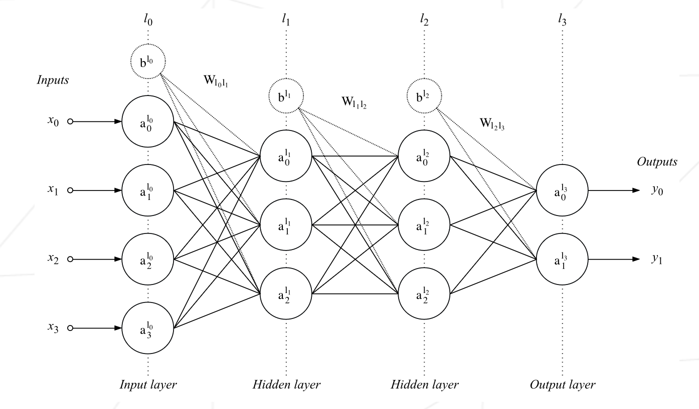
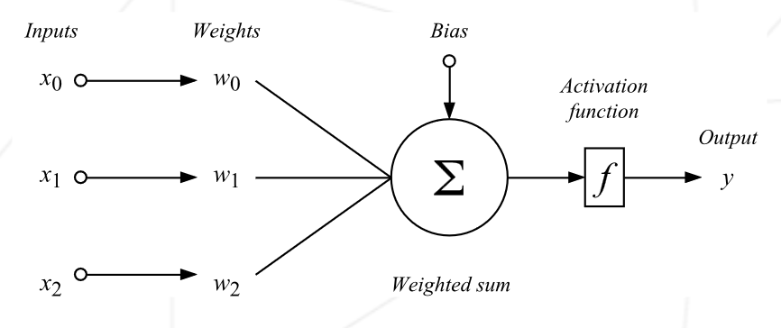
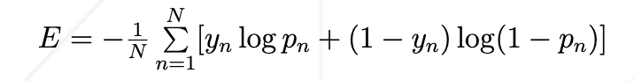

## multilayer_perceptron

### A 42 AI project.

`The multilayer perceptron is a feedforward network (meaning that the data
flows from the input layer to the output layer) defined by the presence of one or more
hidden layers as well as an interconnection of all the neurons of one layer to the next.`

>Preceptron
>

>The prediction is evaluated using the binary cross-entropy error function:
>

